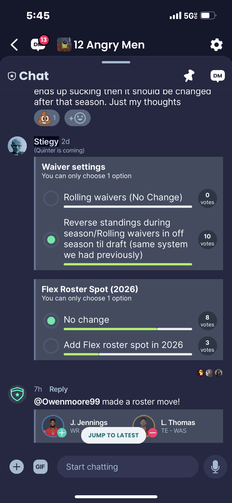
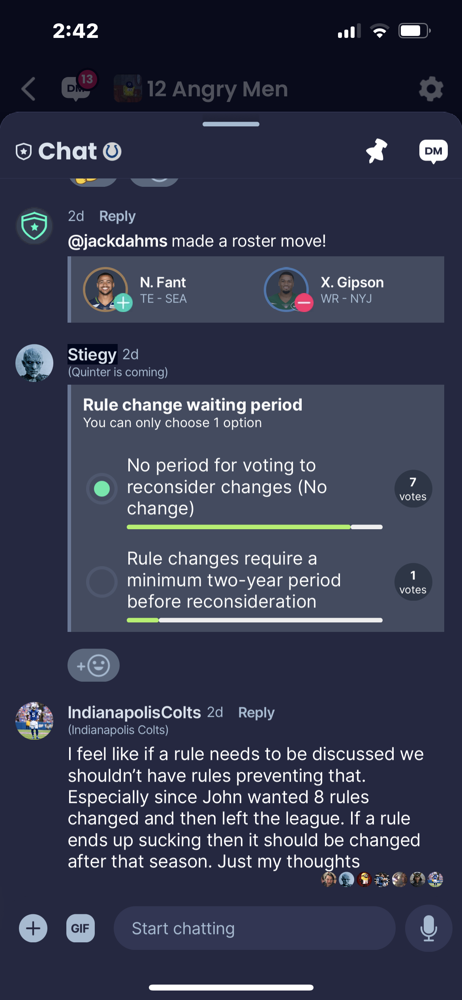

<small> This page will document upcoming changes that have been requested by teams to be discussed an voted on in the offseason. Voting results for each issue will also be posted here once finalized </small>

## 2024

<small> These changes will be discussed after the 2024-2025 season. </small>

- Revert to using PF (Points For) to determine draft positions for the bottom four teams instead of Max PF. (PASSED)

### 2024 Vote Results

  

## 2023

<small> These changes will be discussed after the 2023-2024 season. </small>

- Add a minimum 2 yr period before rule changes can be re-voted on. (REJECTED)
- Add extra flex roster spot (in 2 yrs) (REJECTED)
- Revert to old waiver wire pattern (reverse standings during the regular season) (PASSED)

### 2023 Vote Results

  
  

